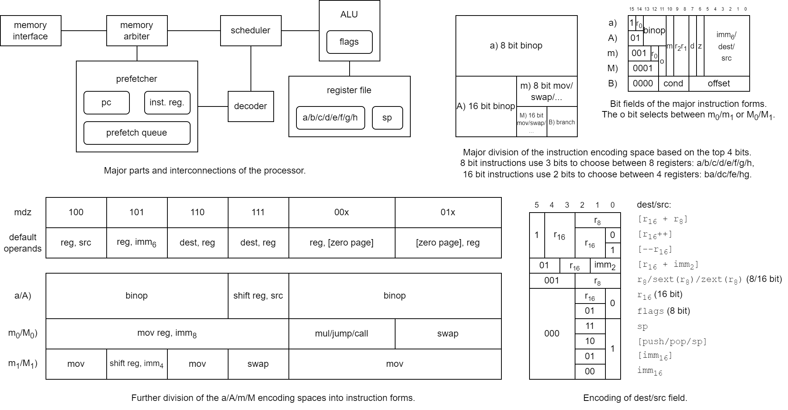

   

Basilisc-2816: Small 2-bit serial 8/16 bit CPU for Tiny Tapeout 7
=================================================================

Basilisc-2816 v0.1 is a small 2-bit serial 2/8/16 bit processor that fits into one Tiny Tapeout tile.
It has been designed around the constraints of

- small area,
- 4 pin serial memory interface to a RAM emulator implemented in an RP2040 microcontroller (which can be supported by the RP2040 microcontroller on the Tiny Tapeout 7 Demo Board),
- to be suitable to be included in in the next version of the AnemoneGrafx-8 retro console https://github.com/toivoh/tt06-retro-console, which motivates the other constraints.

Features:

- 2-bit serial execution:
	- ALU results etc are calculated at 2 bits/cycle
	- 2-bit-serial register file with two read/write ports
	- Saves area compared to processing 8/16 bits per cycle / using a parallel access register file
	- No point in calculating faster than the memory interface allows
- 8x 8-bit general purpose registers that can be paired into 4x 16-bit general purpose registers, plus an 8 bit stack register
- 8 bit and 16 bit versions of almost all instructions
- 64 kB address space
- 16 bits/instruction
- Quite regular and orthogonal instruction encoding, most instructions can use most addressing modes
	- `op reg, src` and `op src, reg` instruction forms
- Instructions:
	- `mov`, `swap`
	- `binop`: `add/adc/sub/sbc/and/or/xor/cmp/test`
		- for register-to-register also: `neg/negc/revsub/revsbc/and_not/or_not/xor_not/not`,
	- `shl/shr/sar/rol/ror` with variable or immediate shift count,
	- `mul`: 8x8 and 8x16 bit multiply instructions, producing 2 result bits per cycle like everything else,
	- `branch cc, offset`: relative branch
		- unconditional/call/12 conditions including signed/unsigned comparisons,
	- `jump/call`: absolut direct/indirect jump/call,
	- additional functionality through combination with addressing modes, e g, `ret = jump [pop]`
- Addressing modes:
	- `[imm7]` / `[imm7*2]`: zero page
	- `[r16 + imm2]`
	- `[r16 + r8]`
	- `[r16]` with postincrement/predecrement
	- `[push]` / `[pop]` / `[top-of-stack]` depending on whether the operand is written/read/modified
	- `[imm16]`
- Sign/zero extension of any 8 bit register as source operand to 16 bit instructions
- `imm16` / `[imm16]` operands supported using extra instruction word
- 2-4 word instruction prefetch queue

Basilisc-2816 v0.1 has been taped out in three variants for Tiny Tapeout 7:

	        mul           Prefetch     Hardened     Uses      Mux
	        instruction   queue size   with         latches   address
	v0.1a           yes            2   OpenLane 1        no       967
	v0.1b            no            3   OpenLane 2        no       202
	v0.1c           yes            4   OpenLane 2       yes        72

successively more experimental. Longer prefetch queue should help contribute to better performance,
especially with long memory access latencies.

The target clock frequency is 40 MHz for v0.1a, and 50 MHz for the others, but the max frequency may be higher or lower in practice.
It is unknown how the use of latches will affect max clock frequency (and correctness).
Reducing the memory access latency may be more important to performance than using a high clock frequency.

The three variants are availble at
- v0.1a: https://github.com/toivoh/tt07-basilisc-2816-cpu
- v0.1b: https://github.com/toivoh/tt07-basilisc-2816-cpu-OL2
- v0.1c: https://github.com/toivoh/tt07-basilisc-2816-cpu-experimental

This is the v0.1a version.
For more details, see https://github.com/toivoh/tt07-basilisc-2816-cpu/blob/main/docs/info.md.
